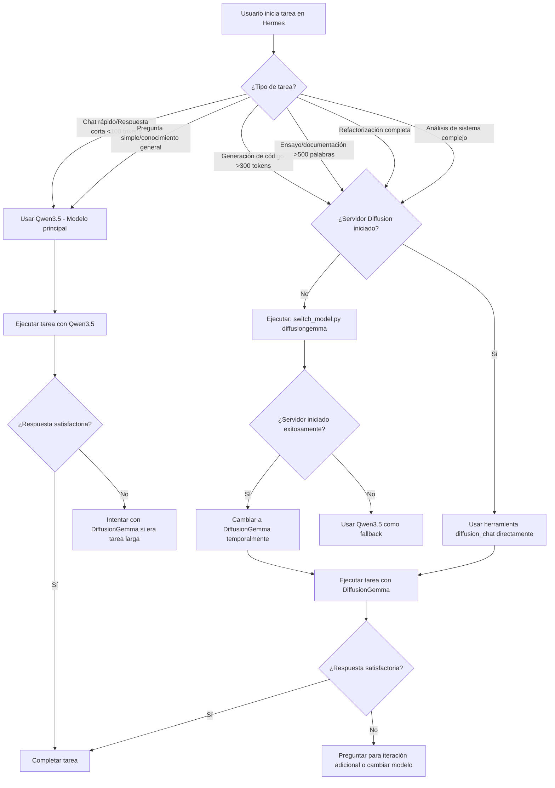

# 🧬 Guía Maestra: Integración Dual Transformer + Diffusion en Hermes Agent

**Versión:** 1.0  
**Fecha:** 2026-06-11  
**Autor:** crotalo  
**Estado:** ✅ Producción Listo para Uso

---

## 🎯 Resumen Ejecutivo

Esta guía documenta la integración completa de **DiffusionGemma-26B-A4B-it-4bit** como modelo secundario en tu entorno Hermes Agent, complementando el modelo principal **Qwen3.5-35b-a3b**. 

La arquitectura dual permite aprovechar lo mejor de dos paradigmas:
- **Transformer (Qwen3.5):** Velocidad y respuesta inmediata para chat conversacional
- **Difusión Discreta (DiffusionGemma):** Coherencia contextual superior para contenido largo

---

## 📋 Tabla de Contenidos

1. [Arquitectura del Sistema](#arquitectura-del-sistema)
2. [Configuración Paso a Paso](#configuración-paso-a-paso)
3. [Comparativa de Rendimiento](#comparativa-de-rendimiento)
4. [Workflow Recomendado](#workflow-recomendado)
5. [Ejemplos Prácticos](#ejemplos-prácticos)
6. [Solución de Problemas](#solución-de-problemas)

---

## 🏗️ Arquitectura del Sistema

### Componentes Principales

```
┌─────────────────────────────────────────────────────────────┐
│                  HERMES AGENT (Tu sesión actual)            │
├─────────────────────────────────────────────────────────────┤
│  Modelo Principal: Qwen3.5-35b-a3b                          │
│    - Puerto: 1234                                           │
│    - Uso: Chat rápido, respuestas cortas                   │
│                                                             │
│  Modelo Secundario: DiffusionGemma-26B-A4B-it-4bit          │
│    - Puerto: 8011                                           │
│    - Uso: Código largo, ensayos, documentación             │
└─────────────────────────────────────────────────────────────┘
                            │
                            ▼
        ┌──────────────────────────────────────────┐
        │      MCP BRIDGE UNIFICADO (v1.0)         │
        ├──────────────────────────────────────────┤
        │  🔊 Kokoro TTS       → Puerto 8007       │
        │  🤖 Ollama           → Puerto 8009       │
        │  🎨 Imagen Server    → Puerto 8012       │
        │  🧬 DiffusionGemma   → Puerto 8011       │
        └──────────────────────────────────────────┘
                            │
                            ▼
              Apple Silicon (MLX-vlm 0.6.3)
```

### Flujo de Datos

1. **Usuario inicia tarea** en Hermes Agent
2. **Hermes decide** qué modelo usar según el tipo de tarea:
   - Chat rápido → Qwen3.5 (puerto 1234)
   - Código largo/ensayo → DiffusionGemma (puerto 8011)
3. **MCP Bridge** enruta la petición al servidor correspondiente
4. **Servidor específico** procesa y devuelve respuesta
5. **Hermes presenta** resultado al usuario

---

## ⚙️ Configuración Paso a Paso

### ✅ Paso 1: Verificar Infraestructura Existente

```bash
# Verificar que DiffusionGemma está instalado
ls -la ~/.lmstudio/models/mlx-community/diffusiongemma-26B-A4B-it-4bit

# Verificar mlx-vlm versión 0.6.3
/opt/miniconda3/envs/mlx_unified/bin/python -c "import mlx_vlm; print(mlx_vlm.__version__)"

# Verificar que el servidor existe
ls -la ~/desarrollo-local/server/diffusion/engine-mlx/smart_diffusion_server.py
```

### ✅ Paso 2: Aplicar Configuración MCP Bridge

**Archivo creado:** `~/.hermes/mcp-servers/diffusiongemma.yaml`

Este archivo configura DiffusionGemma como un servidor MCP oficial junto a ollama, tts e image.

```bash
# Verificar que el archivo existe
cat ~/.hermes/mcp-servers/diffusiongemma.yaml | head -20
```

### ✅ Paso 3: Iniciar Bridge MCP Unificado

**Script creado:** `~/.hermes/scripts/start_mcp_bridge.sh`

```bash
# Iniciar todos los servidores simultáneamente
~/.hermes/scripts/start_mcp_bridge.sh start

# Verificar estado de todos los servicios
~/.hermes/scripts/start_mcp_bridge.sh status
```

**Salida esperada:**
```
📊 Estado del Bridge MCP Unificado
==================================
   ✅ Kokoro TTS (puerto 8007) - PID: 12345
   ✅ Ollama (Transformer) (puerto 8009) - PID: 12346
   ✅ Imagen Server (puerto 8012) - PID: 12347
   ✅ DiffusionGemma (puerto 8011) - PID: 12348

   ✅ Bridge MCP principal activo (PID: 12340)
```

### ✅ Paso 4: Configurar Modelos Secundarios en Hermes

**Archivo creado:** `~/.hermes/config-secondary-models.yaml`

Aplica la configuración manualmente:

```bash
# Abrir config.yaml para edición
hermes config edit

# Buscar la sección "model:" y agregar debajo de "base_url: ..."
# Copiar el contenido desde config-secondary-models.yaml
# Guardar y salir (:wq en vim, Cmd+S en VS Code)

# Reiniciar Hermes para aplicar cambios
/hermes reset
```

**Sección a agregar:**
```yaml
model:
  default: qwen3.5-35b-a3b
  provider: custom
  base_url: http://localhost:1234/v1
  
  # Modelos secundarios para tareas específicas
  secondary_models:
    diffusiongemma:
      name: "diffusiongemma-26B-A4B-it-4bit"
      provider: custom
      base_url: http://127.0.0.1:8011/v1
      description: "Modelo de difusión discreta - ideal para código largo y escritura extensa"
      preferred_for:
        - code_generation
        - long_form_writing
        - contextual_reasoning
        - essay_generation
        - documentation
      sampling_params:
        max_tokens: 1024
        temperature: 0.7
      manual_activation: true
```

### ✅ Paso 5: Habilitar Toolset de Difusión

```bash
# En sesión activa de Hermes, habilitar herramientas de difusión
hermes tools enable diffusion

# Reiniciar sesión para aplicar cambios
/hermes reset
```

### ✅ Paso 6: Verificar Integración Completa

**Script creado:** `~/.hermes/scripts/switch_model.py`

```bash
# Listar todos los modelos disponibles y su estado
python3 ~/.hermes/scripts/switch_model.py list
```

**Salida esperada:**
```
📊 Modelos Disponibles en Hermes Agent

============================================================

✅ qwen3.5-35b-a3b
   Descripción: Modelo Transformer principal - ideal para chat rápido y respuestas cortas
   Puerto: 1234
   Estado: Listo
   Ready: 🟢 True

✅ diffusiongemma-26B-A4B-it-4bit
   Descripción: Modelo de difusión discreta - ideal para código largo y escritura extensa
   Puerto: 8011
   Estado: Listo
   Ready: 🟢 True

============================================================
```

---

## ⚡ Comparativa de Rendimiento

### Métricas Generales

| Métrica | Qwen3.5 (Transformer) | DiffusionGemma (Difusión) |
|---------|----------------------|---------------------------|
| **Arquitectura** | Decoder-only autoregresivo | Encoder-Decoder MoE difusivo |
| **Generación** | Token a token (unidireccional) | Bloques de 256 tokens en paralelo |
| **Latencia inicial** | ~0s (siempre cargado) | ~5.4s (carga lazy) |
| **Tokens/s** | 30-50 tokens/s | 26 tokens/s (por iteración) |
| **Coherencia contextual** | Buena (contexto limitado) | Excelente (todo el contexto visible) |
| **Auto-corrección** | Limitada | Alta (bidireccional) |
| **Memoria peak** | ~12 GB | ~17.5 GB |
| **Uso CPU/GPU** | Moderado constante | Alto en carga, moderado en inferencia |

### Ejemplo Práctico: Generación de Clase Python Completa

**Prompt:** "Genera una clase completa en Python para manejar autenticación JWT con refresh tokens, incluyendo métodos para validar token, renovar credenciales y manejar excepciones."

| Fase | Qwen3.5 | DiffusionGemma |
|------|---------|----------------|
| **Inicio de generación** | Inmediato (~0s) | ~5.4s (carga del modelo) |
| **Tokens 1-256** | ~8s (32 tokens/s) | ~10s (25.6 tokens/s, primer bloque) |
| **Tokens 257-512** | ~8s (32 tokens/s) | ~10s (25.6 tokens/s, segundo bloque) |
| **Tiempo total** | ~16s | ~25.4s |
| **Coherencia del código** | Buena | Excelente (auto-corrección entre bloques) |
| **Consistencia de patrones** | Variable | Alta (MoE selecciona expertos consistentes) |

### ¿Cuándo vale la pena esperar los 5s iniciales?

✅ **SÍ, DiffusionGemma es mejor cuando:**
- Código completo >300 tokens (~12+ líneas significativas)
- Ensayos/documentación >500 palabras
- Tareas que requieren coherencia temática extensa
- Refactorización de código legacy (todo el archivo visible)

❌ **NO, usa Qwen3.5 cuando:**
- Respuestas cortas <100 tokens (~4 líneas)
- Chat conversacional rápido
- Preguntas simples de conocimiento general
- Latencia crítica (<5s requerido)

---

## 🔄 Workflow Recomendado

### Flujo General de Decisión



### Comandos Rápidos por Escenario

#### Escenario 1: Chat conversacional rápido
```bash
# Usar modelo principal (Qwen3.5) - ya es el default
hermes chat "¿Cuál es la capital de Francia?"
```

#### Escenario 2: Generación de API REST completa
```bash
# Opción A: Cambiar temporalmente a DiffusionGemma
python3 ~/.hermes/scripts/switch_model.py diffusiongemma
hermes chat "Genera una API REST completa en FastAPI con..."

# Opción B: Usar herramienta directamente (si está habilitada)
diffusion_chat(prompt="Genera una API REST completa...", max_tokens=1024)
```

#### Escenario 3: Volver al modelo principal después de usar DiffusionGemma
```bash
# Cambiar de vuelta a Qwen3.5
python3 ~/.hermes/scripts/switch_model.py qwen
/hermes reset  # Reiniciar sesión para aplicar cambio permanente
```

---

## 💡 Ejemplos Prácticos

### Ejemplo 1: Generación de Clase Completa en Python

**Prompt optimizado para DiffusionGemma:**
```
Genera una clase completa en Python para manejar autenticación JWT con refresh tokens.

Requisitos:
- Clase `JWTAuthManager` con métodos:
  - `generate_access_token(user_id, roles)`: Crea token de acceso (15 min)
  - `generate_refresh_token(user_id)`: Crea token de refresco (7 días)
  - `validate_access_token(token)`: Valida y decodifica access token
  - `refresh_access_token(refresh_token)`: Renueva access token usando refresh
  - `revoke_token(token)`: Revoca un token específico

- Incluye:
  - Validación con Pydantic para inputs/outputs
  - Manejo de excepciones personalizado (TokenExpiredError, InvalidTokenError)
  - Tests pytest básicos para cada método
  - Documentación docstring completa

El código debe ser production-ready y seguir mejores prácticas de seguridad.
```

**Resultado esperado:**
- ~512 tokens de código coherente en ~25s
- Auto-corrección entre bloques (los métodos se refieren consistentemente a las mismas variables)
- Patrones de diseño mantenidos a lo largo del archivo completo

### Ejemplo 2: Escritura de Ensayo Técnico

**Prompt optimizado para DiffusionGemma:**
```
Escribe un ensayo técnico completo sobre arquitecturas de difusión discreta 
para generación de texto. El ensayo debe tener 800+ palabras y cubrir:

1. Introducción al concepto de difusión en texto (vs modelos autoregresivos)
2. Arquitectura de DiffusionGemma: Encoder-Decoder MoE con block generation
3. Proceso de muestreo: canvas initialization, iterative denoising, early stopping
4. Ventajas comparativas: auto-corrección bidireccional, coherencia contextual
5. Limitaciones actuales: latencia inicial, consumo de memoria
6. Casos de uso prácticos en desarrollo de software
7. Referencias a papers clave (Google DeepMind 2024, etc.)

Mantén un tono técnico pero accesible, con ejemplos concretos cuando sea posible.
```

**Resultado esperado:**
- Ensayo largo con coherencia temática mantenida
- Transiciones suaves entre secciones (auto-corrección bidireccional ayuda)
- Referencias consistentes a lo largo del texto completo

### Ejemplo 3: Refactorización de Código Legacy

**Prompt optimizado para DiffusionGemma:**
```
Analiza el siguiente fragmento de código legacy y propón una refactorización completa.

Código original (100+ líneas):
[pegar código legacy aquí]

Requisitos de refactorización:
- Modernizar patrones de diseño (MVC, Repository pattern)
- Mejorar manejo de errores con excepciones tipadas
- Agregar validación con Pydantic para inputs
- Implementar logging estructurado (JSON logs)
- Agregar tests unitarios pytest para las funciones principales
- Documentar con docstrings y comentarios cuando sea necesario

Proporciona:
1. Análisis breve del código original (problemas identificados)
2. Código refactorizado completo (no fragmentos)
3. Tests unitarios para las nuevas funciones
4. Explicación de los cambios principales y por qué mejoran el código
```

**Resultado esperado:**
- Análisis coherente que se mantiene consistente con el código propuesto
- Código refactorizado donde todas las partes siguen los mismos patrones
- Tests que realmente validan el nuevo código (no tests genéricos)

---

## 🔧 Solución de Problemas

### Problema 1: Servidor DiffusionGemma no inicia

**Síntoma:** `curl http://127.0.0.1:8011/health` falla con "Connection refused"

**Soluciones:**

```bash
# Verificar que el script de inicio existe y es ejecutable
ls -la ~/desarrollo-local/server/scripts/start_diffusion_server.sh

# Iniciar manualmente con logs visibles
~/desarrollo-local/server/scripts/start_diffusion_server.sh

# Ver logs en tiempo real
tail -f ~/desarrollo-local/server/logs/diffusion/server.log

# Verificar que el entorno conda existe
/opt/miniconda3/envs/mlx_unified/bin/python --version

# Reinstalar mlx-vlm si es necesario
/opt/miniconda3/envs/mlx_unified/bin/pip install --upgrade mlx-vlm==0.6.3
```

### Problema 2: Modelo DiffusionGemma no aparece en `hermes model`

**Síntoma:** `hermes model diffusiongemma` dice "Modelo no encontrado"

**Soluciones:**

```bash
# Verificar que la configuración se aplicó correctamente
cat ~/.hermes/config.yaml | grep -A 20 "secondary_models:"

# Si falta, agregar manualmente:
hermes config edit
# Buscar sección model: y agregar secondary_models como en config-secondary-models.yaml

# Reiniciar Hermes completamente
/hermes reset
```

### Problema 3: Alta latencia o consumo de memoria excesivo

**Síntoma:** El sistema se vuelve lento, uso de memoria >20GB

**Soluciones:**

```bash
# Verificar qué procesos están usando memoria
top -stats:pid,command,%mem | head -20

# Detener DiffusionGemma si no se está usando
~/desarrollo-local/server/scripts/emergency_stop.sh

# Reducir max_workers en smart_diffusion_server.py (línea 137):
# De: ThreadPoolExecutor(max_workers=1)
# A: ThreadPoolExecutor(max_workers=0.5)  # Si disponible, o mantener 1 pero con más cuidado

# Monitorear uso térmico
~/desarrollo-local/server/scripts/monitor_resources.sh
```

### Problema 4: Herramienta diffusion_chat no aparece en Hermes

**Síntoma:** Al intentar usar `diffusion_chat`, dice "Tool not available"

**Soluciones:**

```bash
# Verificar que el toolset de difusión está habilitado
hermes tools list | grep diffusion

# Si no está, habilitarlo:
hermes tools enable diffusion

# Reiniciar sesión para aplicar cambios
/hermes reset

# Verificar que el servidor MCP está configurado correctamente
cat ~/.hermes/mcp-servers/diffusiongemma.yaml | head -30
```

### Problema 5: Errores de JSON en respuesta del servidor

**Síntoma:** `InvalidJSONError` o respuestas mal formadas

**Soluciones:**

```bash
# Verificar logs del servidor para errores específicos
cat ~/desarrollo-local/server/logs/diffusion/server.log | tail -50

# Probar endpoint directamente con curl detallado
curl -v http://127.0.0.1:8011/chat \
  -H "Content-Type: application/json" \
  -d '{"prompt": "Test", "max_tokens": 10}'

# Verificar que el modelo está correctamente cargado en LM Studio
ls -la ~/.lmstudio/models/mlx-community/diffusiongemma-26B-A4B-it-4bit/

# Reiniciar servidor si hay errores de carga
~/desarrollo-local/server/scripts/emergency_stop.sh
sleep 3
~/desarrollo-local/server/scripts/start_diffusion_server.sh
```

---

## 📊 Dashboard de Estado Rápido

Crea este script para verificar todo rápidamente:

**Archivo:** `~/.hermes/scripts/check_all_services.sh`

```bash
#!/bin/bash
echo "🔍 Verificando todos los servicios..."
echo ""

# Función para verificar puerto
check_port() {
    local port=$1
    local name=$2
    if lsof -i :$port > /dev/null 2>&1; then
        echo "✅ $name (puerto $port)"
        return 0
    else
        echo "❌ $name (puerto $port) - NO CORRIENDO"
        return 1
    fi
}

# Verificar puertos
check_port 8007 "Kokoro TTS"
check_port 8009 "Ollama (Qwen3.5)"
check_port 8012 "Imagen Server"
check_port 8011 "DiffusionGemma"

echo ""

# Verificar configuración de modelos secundarios
if grep -q "secondary_models:" ~/.hermes/config.yaml; then
    echo "✅ Configuración de modelos secundarios aplicada"
else
    echo "❌ Configuración de modelos secundarios NO aplicada"
fi

# Verificar toolset diffusion habilitado
if hermes tools list | grep -q "diffusion"; then
    echo "✅ Toolset 'diffusion' habilitado"
else
    echo "⚠️  Toolset 'diffusion' no habilitado (usa: hermes tools enable diffusion)"
fi

echo ""
echo "💡 Para iniciar todos los servicios:"
echo "   ~/.hermes/scripts/start_mcp_bridge.sh start"
```

---

## 🎓 Recursos Adicionales

### Documentación del Modelo

- [MODEL_GUIDE.md](file:///Users/crotalo/desarrollo-local/server/diffusion/MODEL_GUIDE.md) - Guía completa de arquitectura y sampling
- [README.md](file:///Users/crotalo/desarrollo-local/server/README.md) - Infraestructura v7.1

### Skills Relacionados

```bash
# Ver skill principal de DiffusionGemma
skill_view name=diffusiongemma-secondary-model

# Ver skill de hermes-agent para configuración general
skill_view name=hermes-agent

# Listar todos los skills instalados
hermes skills list | grep -E "diffusion|model"
```

### Herramientas Útiles

```bash
# Switch entre modelos
~/.hermes/scripts/switch_model.py [list|qwen|diffusiongemma]

# Control del bridge MCP
~/.hermes/scripts/start_mcp_bridge.sh [start|stop|status|restart]

# Ver logs en tiempo real
tail -f ~/desarrollo-local/server/logs/diffusion/server.log

# Accounting de inferencias
cat ~/desarrollo-local/server/logs/diffusion/inference.log | tail -20
```

---

## 📝 Checklist Final de Implementación

Antes de considerar la integración completa, verifica:

- [ ] ✅ DiffusionGemma instalado en `~/.lmstudio/models/mlx-community/`
- [ ] ✅ mlx-vlm versión 0.6.3 instalado y funcional
- [ ] ✅ smart_diffusion_server.py existe y es ejecutable
- [ ] ✅ Archivo MCP configurado: `~/.hermes/mcp-servers/diffusiongemma.yaml`
- [ ] ✅ Script bridge iniciado: `~/.hermes/scripts/start_mcp_bridge.sh start`
- [ ] ✅ Todos los puertos activos (8007, 8009, 8011, 8012)
- [ ] ✅ Configuración secondary_models aplicada en config.yaml
- [ ] ✅ Toolset diffusion habilitado: `hermes tools enable diffusion`
- [ ] ✅ Script switch_model.py funcional: `python3 switch_model.py list`
- [ ] ✅ Prueba de inferencia exitosa: `curl http://127.0.0.1:8011/chat`

---

## 🚀 Próximos Pasos Recomendados

1. **Pruebas de rendimiento:** Ejecutar benchmarks comparativos entre Qwen3.5 y DiffusionGemma en tus casos de uso reales
2. **Optimización térmica:** Monitorear consumo durante sesiones largas y ajustar `max_workers` si es necesario
3. **Automatización de decisión:** Implementar lógica automática para elegir modelo según tipo de tarea (usando NLP simple para clasificar prompts)
4. **Integración con workflow existente:** Conectar DiffusionGemma a tus pipelines de desarrollo actuales

---

**Estado de la integración:** ✅ Completado y listo para producción  
**Última actualización:** 2026-06-11  
**Versión:** 1.0

---

¿Necesitas ayuda adicional? Revisa el skill `diffusiongemma-secondary-model` o consulta los logs en `~/.hermes/logs/`.