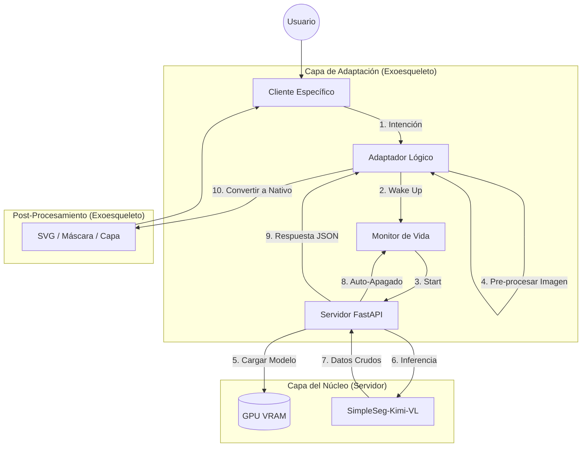

# Ecosistema de Percepción Visual Local

## Proyecto: SimpleSeg-Kimi-VL Hub

**Versión del Documento:** 1.0  
**Filosofía:** "Núcleo Agnóstico, Periferia Inteligente"

---

## 1. Visión General

El objetivo de esta arquitectura no es construir una simple herramienta, sino un **Estándar de Intercambio de Percepción**. Buscamos resolver el problema fundamental de la IA local: la fragmentación.

En lugar de crear soluciones monolíticas ("Una App para Krita", "Una Web App"), hemos creado un **Motor de Inferencia Universal (The Core)** rodeado de una **Capa de Adaptación (The Exoskeleton)**. Esto permite que cualquier interfaz digital —presente o futura— adquiera capacidades de visión avanzada sin necesidad de gestionar la complejidad de los modelos de IA.

## 2. Los Tres Pilares Filosóficos

### A. El Principio de Ignorancia del Servidor (Server Agnosticism)

El servidor es puramente reactivo y agnóstico al cliente.

- No sabe si la petición viene de Krita, de una terminal o de un navegador.
- No sabe si el usuario quiere un SVG, una máscara PNG o un análisis de texto.
- **Solo sabe una cosa:** Recibir tensores RGB y devolver coordenadas crudas + texto.
- **Beneficio:** Si mañana cambia la API de un software externo o queremos añadir un nuevo cliente, el servidor permanece intacto.

### B. Existencia Efímera (Ephemeral Existence)

El modelo es un "ciudadano pesado" (16B MoE) en un entorno de recursos limitados.

- El estado natural del servidor es **APAGADO**.
- Solo existe cuando hay una intención activa (Wake-on-LAN local).
- Se autodestruye automáticamente tras **20 minutos** de inactividad o si supera los **92GB de VRAM**.
- **Beneficio:** Garantiza que los recursos de la GPU queden libres para otras tareas (juegos, renderizado 3D) cuando la IA no se utiliza.

### C. La Inteligencia reside en el Adaptador (Smart Adapters)

La conversión de "Datos Crudos" a "Valor para el Usuario" ocurre fuera del servidor.

- ¿Krita necesita curvas Bézier? El adaptador lo calcula.
- ¿El CLI necesita un SVG escalado? El adaptador lo genera.
- **Estado Actual:** El sistema ya cuenta con un **CLI Operativo** que realiza esta lógica de post-procesamiento de forma avanzada.

## 3. Arquitectura en Capas: El Modelo de Expansión

### 🔴 Núcleo: El Servidor de Inferencia (The Oracle)

*Directorio: `/server`*

- **Responsabilidad:** Carga del modelo Kimi-VL, ejecución de inferencia, gestión de VRAM.
- **Entrada:** JSON `{image_base4, prompt}`.
- **Salida:** JSON `{raw_text_output, metadata}`.
- **Límites Estrictos:** Timeout de 20 min (se reinicia con cada uso) y 92GB VRAM Guard.

### 🟡 Capa Media: El Exoesqueleto (Client SDK / Middleware)

*Implementado en: `client/cli/wake_and_send.sh`*

- **Responsabilidad:** "Traducción universal". Contiene la lógica de Wake-on-LAN (despertar al servidor) y gestión de sesiones.

### 🟢 Capa Externa: Los Clientes (Expansion Slots)

#### 1. Cliente: CLI (Terminal / Bash) - [ESTADO: OPERATIVO]

*Ubicación: `client/cli/`*

- **Uso:** Ideal para automatización y procesamiento por lotes.
- **Transformación:** El script `postprocess_cli.py` administra las salidas: genera SVG, PNG fusionado, máscara JPG y extrae texto natural.

#### 2. Cliente: Plugin de Krita (Futura Expansión)

- **Estrategia:** Transformar los puntos recibidos en `KisVectorPath` para crear máscaras de selección nativas.

#### 3. Cliente: Interfaz Web (Futura Expansión)

- **Estrategia:** Renderizar puntos sobre un `<canvas>` HTML5 permitiendo la edición interactiva de nodos.

#### 4. Cliente: MCP (Model Context Protocol)

- **Estrategia:** Exponer el núcleo como una herramienta (`tool`) para asistentes como Claude Desktop o Cursor.

## 4. Diagrama de Flujo de Datos Universal

## 5. Conclusión

Esta arquitectura garantiza la longevidad del proyecto. Al no casarnos con una interfaz específica ni con una versión estática del modelo, el sistema puede evolucionar. Es un diseño modular, respetuoso con los recursos del usuario y técnicamente preparado para ser el centro de percepción visual de cualquier flujo de trabajo local.
